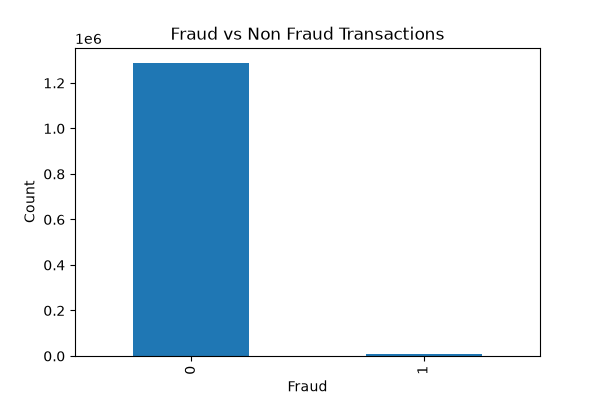
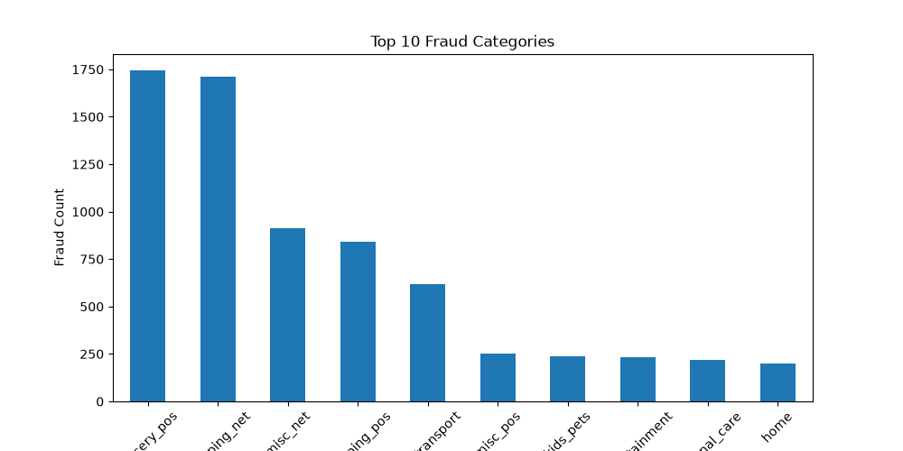
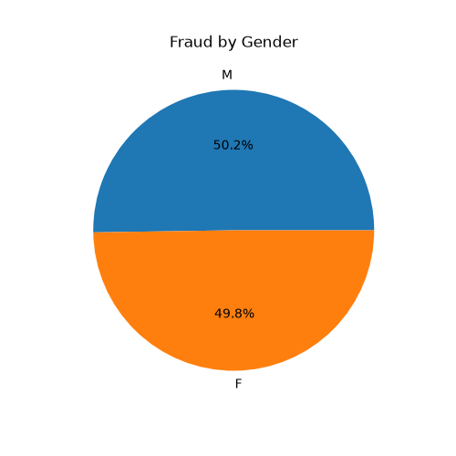
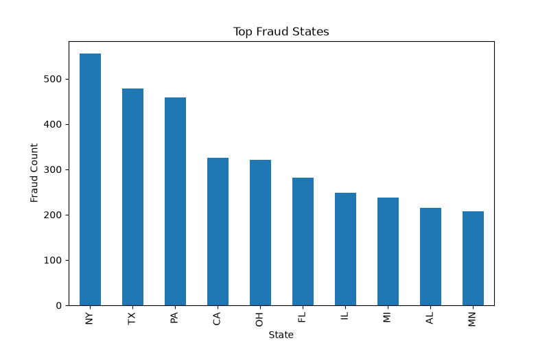
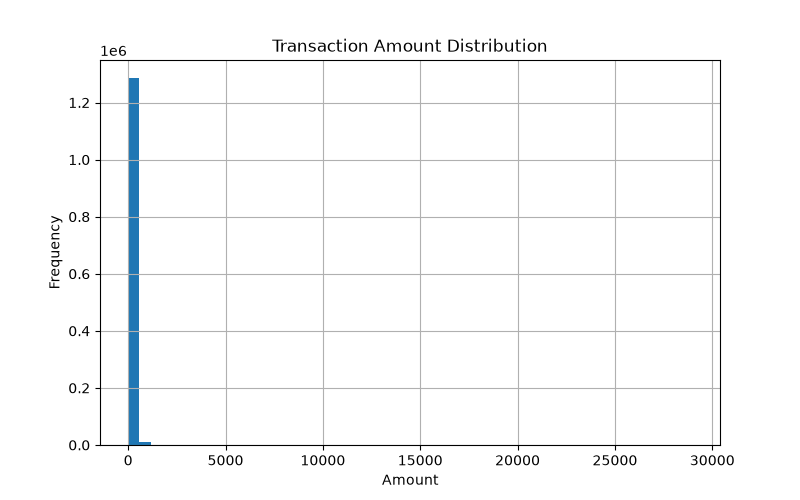

# 🏦 AI Banking Fraud Analytics

## 📌 Project Overview

This project analyzes over **1.29 million banking transactions** to identify fraudulent activities using Python and AI-powered business insights.

The project demonstrates an end-to-end banking fraud analytics workflow including:

- Data Cleaning & Preprocessing
- Exploratory Data Analysis (EDA)
- Data Visualization
- SQL-based Analytics
- Power BI Dashboard Development
- AI-Generated Business Report
- GitHub Version Control

---

# 📊 Dataset Information

- Total Transactions: **1,296,675**
- Fraud Transactions: **7,506**
- Fraud Rate: **0.58%**

---

## 🛠 Technologies Used

- Python
- Pandas
- NumPy
- Matplotlib
- SQL
- Power BI
- Git & GitHub
- VS Code
- Markdown
- ChatGPT (AI-assisted reporting)

---

# 📁 Project Structure

```
AI-Banking-Fraud-Analysis
│
├── 01_Dataset
├── 02_SQL
├── 03_Python
├── 04_PowerBI
├── 05_AI
├── 06_Documentation
├── 07_Images
└── README.md
```

---

# 📈 Key Business Insights

- Fraud Rate: **0.58%**
- Most Fraudulent Categories:
  - Grocery POS
  - Shopping Net
  - Misc Net
- Highest Fraud States:
  - New York
  - Texas
  - Pennsylvania
- Fraud is nearly equally distributed between male and female customers.

---

# 📊 Visualizations

The project includes:

- Fraud vs Non-Fraud Transactions
- Top Fraud Categories
- Top Fraud States
- Fraud by Gender
- Transaction Amount Distribution

## 📊 Project Visualizations

### Fraud vs Non-Fraud Transactions



---

### Top Fraud Categories



---

### Fraud by Gender



---

### Top Fraud States



---

### Transaction Amount Distribution



---

# 🤖 AI Insights

AI-generated executive report includes:

- Executive Summary
- Business Insights
- Risk Assessment
- Recommendations
- Future Improvements

---

## 🚀 Future Scope

- Machine Learning Fraud Detection Models
- Real-Time Fraud Prediction System
- Interactive Power BI Dashboard
- Customer Risk Scoring
- Automated Fraud Alerts

---

## 👩‍💻 Author

**Ayushi Shukla**
Aspiring Data Analyst
📧 Email: ayushishukla7898@gmail.com
🔗 GitHub: https://github.com/Ayushi714