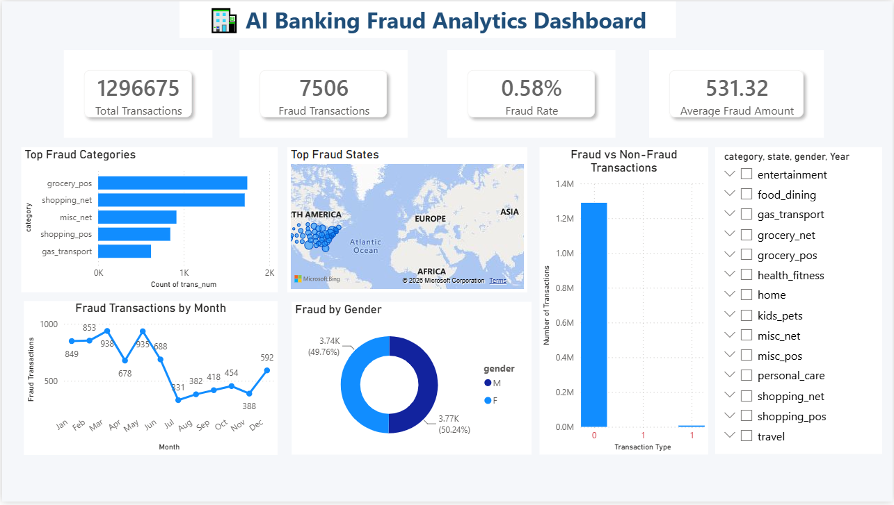

# AI Banking Fraud Analysis

## Project Overview
This project analyzes banking transactions to identify fraudulent activities using Python, SQL, AI insights, and an interactive Power BI dashboard.

## Tools & Technologies
- Python (Pandas, Matplotlib)
- SQL
- Power BI
- Git & GitHub

## Project Structure

01_Dataset/
02_SQL/
03_Python/
04_PowerBI/
05_AI/
06_Documentation/
07_Images/

## Dashboard Preview

## Key Insights
- Fraud Rate: 0.29%
- Total Transactions: 40,507
- Fraud Transactions: 116
- Top Fraud Categories identified
- Fraud analysis by Gender, State and Month

## Features
- Data Cleaning
- Exploratory Data Analysis
- SQL Analysis
- AI Generated Business Insights
- Interactive Power BI Dashboard

## Repository Contents
- Python scripts
- SQL queries
- Power BI Dashboard (PDF Preview)
- Dashboard Screenshots
- AI Report

## Author
Ayushi Shukla